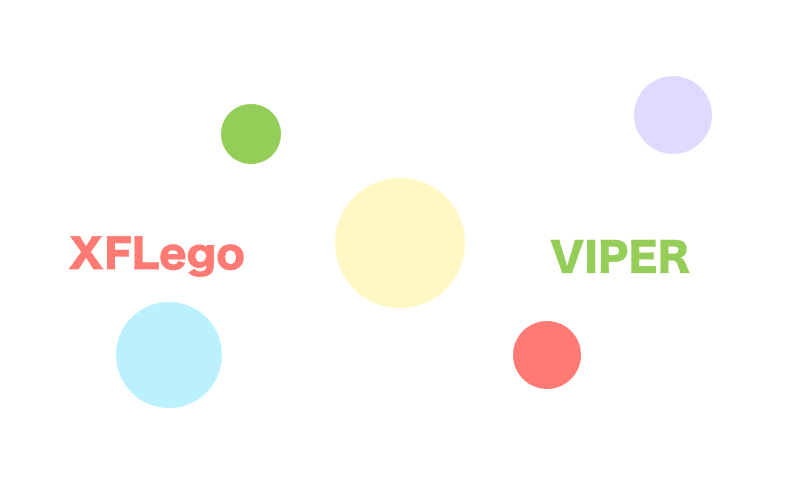
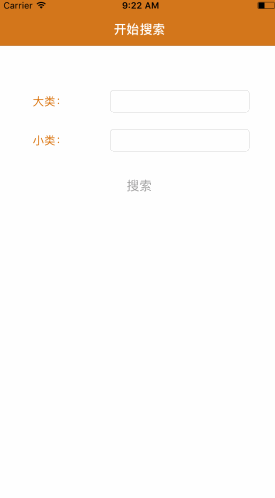
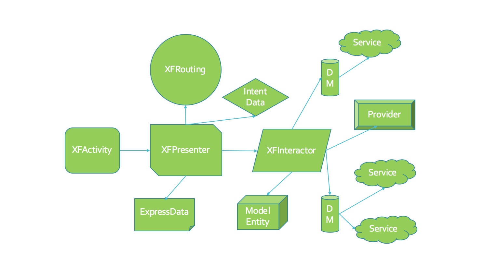

<p align="center">
    
</p>
<p align="center">
  <a href="http://cocoadocs.org/docsets/XFLegoVIPER">
  	
  </a>
  
  
  
</p>

A lightweight framework base on VIPER architecture for IOS that build robust and maintained large scale projects and business logic complex projects. 
一个基于VIPER架构理念的轻量级框架，旨在打造IOS领域的建筑学，目标是构建健壮可维护的大型项目和业务逻辑复杂的项目。
<p align="center">
    
</p>

##什么是VIPER？
VIPER 是一个创建 iOS 应用简明构架的程序。VIPER 可以是视图 (View)，交互器 (Interactor)，展示器 (Presenter)，实体 (Entity) 以及路由 (Routing) 的首字母缩写。简明架构将一个应用程序的逻辑结构划分为不同的责任层。这使得它更容易隔离依赖项 (如数据库)，也更容易测试各层间的边界处的交互。

VIPER不属于MV*架构系列，但它是所有这些架构中单一责任分得最细的一个，有利于大型项目的构建和多人对同一个模块开发，好处有易维护、易迁移、代码多模块共用。VIPER架构结构就像搭积木一个，且很容易从传统MVC架构迁移过来，MVC的代码和VIPER架构可以很容易相互关联与调用，所以可以在一个项目里即有MVC架构的模块，又有VIPER架构的模块。

<p align="center">
    
</p>

##XFLegoVIPER特点
1、快速建立模块与模块之间的关联，实现了不同架构间模块事件通信。

2、内部自动绑定模块的各层之间的关系，实现了模块路由关系链。

3、能很好地结合MVVM设计思想，使用ReactiveCocoa进行数据双向绑定。

4、各层之间通过接口通信，方便多人在同一模块开发，更好地编写单元测试代码。

6、可以与旧项目MVC、MVP、MVVM架构并存，并能快速地从这些架构过渡到VIPER架构代码。

7、小型项目的模块可以只使用路由层（Routing）、视图层(View)、事件层(Presenter)即可。

##XFLegoVIPER框架说明
这个框架包括搭建VIPER架构核心思想代码，扩展支持不同架构模块的事件/通知转发与接收、不同构架的融合处理，而不整合进来一些UI控件、常用工具类等，以使框架足够的轻量，目前github有相关的VIPER框架如下：
* [ViperMcFlurry](https://github.com/rambler-digital-solutions/ViperMcFlurry)：国外人气框架，但提供的输入输出接口和层之间关联属性不明确，自行声明并组装VIPER各层之间的关系，界面跳要写多层Block，核心代码以Storyboard为中心，这个框架还没法用纯代码写UI。。
* [VISPER](https://github.com/barteljan/VISPER)：一个德国人写的，没有英文文档，依赖JLRoutes、VISPER-CommandBus库，API错综复杂，这个框架在VIPER之上又封装了Feature模块特征层、各层Event事件、命令总线CommandBus，每一个模块都要组装这些东西。。
* [Cascavel](https://github.com/orafaelreis/Cascavel)：这是什么gui？提供了一些数据获取与视图展示的不通用方法，没有什么实际用处。。

本框架是不需要学太多流程式API，提供的关键API使用简单，并在对应层提供预处理宏，让位于多层的代码飞快编写，不依赖其它第三方库，除了拆分代码的层次关系而不需要学习过多其它编码思维，代码的运行流程是可见可测的，兼容旧项目中其它架构并与之融合共处，各架构的模块之间有通信机制，兼容XIB/Storyboard/纯代码界面,并可以扩展出与项目业务关系的核心模块。


##安装
1、使用Cocoapods
> pod 'XFLegoVIPER','1.3.1'

2、使用手动添加

把XFLegoVIPER整个库拖入到工程即可


##XFLegoVIPER框架图


##XFLegoVIPER使用文档
###一、模块入口类`XFRouting`
Routing<或称为WireFrame>是一个模块开始的入口，也是管理模块与模块之间的跳转（相当于界面之跳转），它初化始当前模块的的所有层级关系链，也保存着上一个和下一个模块的引用关系链，是整个架构的关键层。

####1、初始化一个模块，建立一个`XFSearchRouting`并继承自`XFRouting`,在.m文件里覆盖`+ (instancetype)routing`方法（使用`Activity`而不使用`UIViewController`是为了和旧项目MVC等架构区别开来）：
```objc
+ (instancetype)routing
{
    /**
     *  代码方式加载 
     *  如果没有UINavigationController这个嵌套，可以传nil，或使用不带navigatorClass参数的方法
     *  除了ActivityClass必传外，其它都可以传空，这种情况适用于对MVC等其它架构的过渡
     */
    return [[super routing] buildModulesAssemblyWithActivityClass:[XFSearchActivity class]
                                                   navigatorClass:[UINavigationController class]
                                                   presenterClass:[XFSearchPresenter class]
                                                  interactorClass:[XFSearchInteractor class]
                                                 dataManagerClass:[XFPictureDataManager class]];
                                                 
   // xib方式加载(格式: x-xibFileName)
    //return [[super routing] buildModulesAssemblyWithIB:@"x-XFDetailsActivity" presenterClass:[XFDetailsPresenter class] interactorClass:nil dataManagerClass:nil];
    
    // storyboard方式(格式: s-storyboardFileName-controllerIdentifier)
    //return [[super routing] buildModulesAssemblyWithIB:@"s-XFDetails-XFDetailsID" presenterClass:[XFDetailsPresenter class] interactorClass:nil dataManagerClass:nil];
}
```
####2、在`UIWindow`上显示：
```objc
    XFSearchRouting *searchRouting = [XFSearchRouting routing];
    // 获得导航栏
    UINavigationController *navigation = searchRouting.realNavigator;
    // TODO: 配置导航栏
    // ...
    // 调用显示方法，之后不用再写[self.window makeKeyAndVisible];
    [searchRouting showRootActivityOnWindow:self.window];
```
####3、模块之间的跳转,这个方法是`XFSearchPresenter`发起对`XFSearchRouting`的请求：
```objc
- (void)transitionToShowResultsMoudle {
    XFPictureResultsRouting *routing = [XFPictureResultsRouting routing];
    // 使用intentData传递意图数据
    // self.uiOperator：相对当前Routing的事件处理层Presenter
    [self pushRouting:routing intent:self.uiOperator.intentData];
}
```

####4、使用路由管理器跟踪打印模块导航信息：
```objc
// 在AppDelegate.m的didFinishLaunchingWithOptions:
[XFRoutingLinkManager enableLog];
```

###二、显示视图层`XFActivity`
在MVP、MVVM、VIPER架构中`UIViewController`和`UIView`一样是View，所以不能再当控制器来使用，而只能做UI的渲染、布局、动画的工作，这也是用`Activity`来替换`ViewController`命名的原因之一。那么谁来充当控制器呢？那就是`XFPresenter`,这个在后面会讲到。 

####1、把一个`UIViewController`转为VIPER里的视图层：
```objc
#import <UIKit/UIKit.h>
#import "XFLegoVIPER.h" // 导入主头文件`XFLegoVIPER.h`头文件

@interface XFSearchActivity : UIViewController

@end
```

####2、请求事件处理

上面的操作会自动绑定在`XFSearchRouting`设置的事件处理者`XFSearchPresenter`,请求事件处理者可以使用：
```objc
    // 转换为事件处理实现的接口
    id<XFSearchEventHandlerPort> presenter = XFConvertPresenterToType(id<XFSearchEventHandlerPort>);
    [presenter loginButtonClickWithName:name pwd:pwd];
```
如果采用MVVM的双向绑定思想，则可以结合ReactiveCocoa的信号传递：
```objc
    id<XFSearchEventHandlerPort> presenter = XFConvertPresenterToType(id<XFSearchEventHandlerPort>);
    RAC(self,title) = RACObserve(presenter, navigationTitle);
    RAC(presenter, mainCategory) = self.mainCategoryTextField.rac_textSignal;
    RAC(presenter, secondCategory) = self.secondCategoryTextFiled.rac_textSignal;
    // 绑定命令
    self.searchButton.rac_command = presenter.executeSearch;
    
    // 其它绑定...
```

###三、事件处理层`XFPresenter`
事件处理层负责界面上的按钮点击事件、页面数据推送填充，而不能对View的渲染、布局直接操作，只针对View行为做出响应。Presenter持有对内容提供者Provider转换过来的界面显示数据`***ExpressData`类的强引用，这个类与模型不同，它拥有界面所需显示的所有对象数据。另外View和Presenter是不能直接引用到模型数据的。

####1、界面显示移除回调方法
```objc
// 视图的显示完成回调方法
- (void)viewDidLoad{} 
// 视图被移除的回调方法
- (void)viewDidUnLoad{} 
```

####2、界面切换回调方法
```objc
// 当前界面将获得焦点时
- (void)viewWillBecomeFocusWithIntentData:(id)intentData{}
// 当前界面将失去焦点时
- (void)viewWillResignFocus{}
```

####3、常用属性与方法
```objc
/**
 * 视图填充数据
 *
 */
@property (nonatomic, strong) id expressData;

/**
 *  错误消息
 */
@property (nonatomic, copy) NSString *errorMessage;

/**
 *  返回按钮被点击的处理方法（子类可以覆盖这个方法实现自己的逻辑）
 */
- (void)xfLego_onBackItemTouch;
```

####4、请求业务数据和界面切换
```objc
// 按钮响应信号方法
- (RACSignal *)executeSearchSignal {
    // 预加载数据
	return [[[XFConvertInteractorToType(id<XFSearchInteractorPort>) fetchPictureDataWithMainCategory:self.mainCategory secondCategory:self.secondCategory] doNext:^(id x) {
        // 设置意图数据
        self.intentData = x;
        // 请求Routing切换界面
        [XFConvertRoutingToType(id<XFSearchWireFramePort>) transitionToShowResultsMoudle];
    }] doError:^(NSError *error) {
        NSLog(@"error %@",error);
    }];
}
```
###四、业务层`XFInteractor`
业务层负责当前模块的核心业务处理与数据转换工作，它完全不关心界面UI与响应事件如果处理，它对原始模型类`***Model`有强引用 ，管理最基层的数据交换。

####1、响应事件处理层的业务数据请求
```objc
- (RACSignal *)fetchPictureDataWithMainCategory:(NSString *)mainCategory secondCategory:(NSString *)secondCategory
{
     return [XFConvertDataManagerToType(XFPictureDataManager *) grabPictureDataWithMainCategory:mainCategory secondCategory:secondCategory];
}
```

####2、模型数据与界面显示数据的转换
```objc
- (RACSignal *)deconstructPreLoadData:(id)preLoadData {
    self.pictureListModel = preLoadData;
    return [RACSignal createSignal:^RACDisposable *(id<RACSubscriber> subscriber) {
        XFPictureProvider *provider = [XFPictureProvider provider];
        [subscriber sendNext:[provider collectedPictureExpressDataFrom:preLoadData]];
        [subscriber sendCompleted];
        return [RACDisposable disposableWithBlock:^{
        }];
    }];
}
```

###五、数据层`***DataManager`和服务层`***Service`
这两层是VIPER架构的补充，它们分别充当数据搬运管理者和本地/远程数据访问服务，这两层的特殊地方是可以在任意模块中使用，所以是无关于模块的，数据层和服务层也是可以分散使用。数据层会对所需的用服务对象`***Service`有强引用，它会调用相关服务对象获得所需的数据，服务层负责本地/远程数据获取。

####1、数据层整理返回给业务层数据
```objc
- (RACSignal *)grabPictureDataWithMainCategory:(NSString *)mainCategory secondCategory:(NSString *)secondCategory
{
    return [self.pictureService pullPictureDataWithMainCategory:mainCategory secondCategory:secondCategory];
}
```

####2、服务层获得远程数据
```objc
- (RACSignal *)pullPictureDataWithMainCategory:(NSString *)mainCategory secondCategory:(NSString *)secondCategory
{
    // 从服务器获取数据
    return [[XFRACHttpTool getWithURL:@"http://image.baidu.com/search/acjson"
                       params:@{
                                @"tn": @"resultjson_com",
                                @"ipn": @"rj",
                                @"word":mainCategory,
                                @"step_word":secondCategory,
                                @"pn": @1, // 第几条开始
                                @"rn": @5, // 返回多少条
                                }]
            map:^id(RACTuple *tuple) {
            // 模型转换
        return [XFPictureListModel mj_objectWithKeyValues:tuple.first];
    }];
}
```

###六、扩展功能
####1、当前模块`Activity`子视图获得`Presenter`事件层

```objc
#import "XFLegoVIPER.h"
@interface SomeView : UIView

@end

@implementation SomeView

- (void)buttonAction:(id)target
{
	// 调用事件处理层
	// 注意：只有在当前视图添加到父视图后才能获取
	[self.eventHandler xfLego_onBackItemTouch];
}
@end
```

####2、不同构架模块间事件通信
本框架实现了不同构架间的模块通信机制：
* 在VIPER架构中，模块通信的发起者和接收者都是事件层`Presenter`。
* 如果从VIPER架构往MVx（MVC、MVP、MVVM）构架发事件通知就在`Presenter`层调用路由层提供的`sendNotificationForMVxWithName:intentData:`方法。
* 如果从MVx构架往VIPER架构发事件就MVx构架的控制器里调用`[XFRoutingLinkManager sendEventName:intentData:forMoudlesName:]`方法。
* 在VIPER架构中接收MVx里的原生通知时使用注册通知`registerForMVxNotificationsWithNameArray:`方法。
```objc

// 一个模块的Presenter发起事件
@implementation XFPictureResultsPresenter

- (void)viewDidLoad
{
    // 发送单模块消息事件
    [self.routing sendEventName:@"loadData" intentData:@"SomeData" forMoudleName:@"Search"];
    // 发送多模块消息事件
    //[self.routing sendEventName:@"loadData" intentData:@"SomeData" forMoudlesName:@[@"Search"]];
    // 在VIPER架构中对MVx架构模块发通知
    //[self.routing sendNotificationForMVxWithName:@"XFReloadDataNotification" intentData:nil];
    
    
    
    // 在MVx架构中使用下面方法对VIPER架构中模块发事件数据
    //[XFRoutingLinkManager sendEventName:@"loadData" intentData:@"SomeData" forMoudlesName:@[@"Search"]];
    
    // 模拟在MVx架构测试发通知
    dispatch_after(dispatch_time(DISPATCH_TIME_NOW, (int64_t)(1 * NSEC_PER_SEC)), dispatch_get_main_queue(), ^{
        [[NSNotificationCenter defaultCenter] postNotificationName:@"StartSearchNotification" object:nil userInfo:@{@"key":@"value"}];
    });
    // 在VIPER架构中注册MVx架构里的原生通知并转为本框架支持的事件，使用`-receiveOtherMoudleEventName:intentData:`接收
    [self.routing registerForMVxNotificationsWithNameArray:@[@"StartSearchNotification"]];
}
@end

// 另一个模块的Presenter接收事件
@implementation XFSearchPresenter

- (void)receiveOtherMoudleEventName:(NSString *)eventName intentData:(id)intentData
{
    NSLog(@"eventName: %@，intentData：%@",eventName,intentData);
}
@end
```

####3、不同架构间的融合
#####3.1、从MVx架构的界面跳转到VIPER架构的界面
```objc
	XFNoticeRouting *routing = [XFNoticeRouting routing];
	XFNoticeActivity *activity = routing.realInterface;
	activity.hidesBottomBarWhenPushed = YES;
	[self.navigationController pushViewController:activity animated:YES];
```

#####3.2、从VIPER架构的界面跳转到MVx架构的界面
```objc
@implementation XFUserRouting

// 使用当前模块的Presenter层调用这个切换界面的方法
- (void)transition2Agreement
{
    // MVx里的界面
    ProvisionViewController *vc = [[ProvisionViewController alloc] init];
    vc.title = @"用户使用协议";
    // 使用当前路由的切换MVx界面方法
    [self pushMVxViewController:vc];
}
@end
```

#####3.3、把MVx架构代码转为VIPER架构
```objc
// 1、先新建一个Routing,把MVx里的ViewController组装进来。
@implementation XFIndexRouting

+ (instancetype)routing
{
    return [[super routing] buildModulesAssemblyWithActivityClass:[XFIndexViewController class] presenterClass:nil interactorClass:nil dataManagerClass:nil];
}
@end

// 2、再一步步简化掉MVx架构里的ViewController的代码到当前模块的事件层`XFIndexPresenter`,并添加到当前路由组装方法。
```

##注意事项
* 在UIViewController/Activity中，覆盖`-viewDidLoad`生命周期方法，要先调用`[super viewDidLoad]`。
* 在UIView中，覆盖`-didMoveToSuperview`生命周期方法，要先调用`[super didMoveToSuperview]`。


##相关文章
[iOS Architecture Patterns](http://www.tuicool.com/articles/rI7ZNn)

[Architecting iOS Apps with VIPER](https://objccn.io/issue-13-5/)

