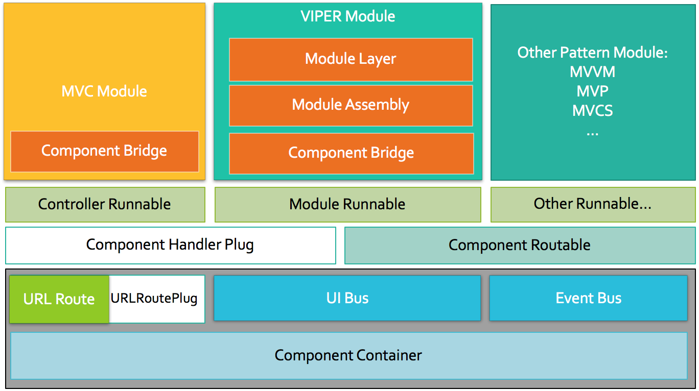

<p align="center">
    
</p>
<p align="center">
  <a href="http://cocoadocs.org/docsets/XFLegoVIPER">
  	
  </a>
  
  
  
</p>

## Note
🚀 A seamless framework for build app from MVC, MVVM, VIPER (etc.) design pattern in iOS world. (OC & Swift)
* Assemble a VIPER module as fast so far, only need one line code.
* Build-In powerful component event communication.
* Real-Time track Component link 💫 .
* Consider MVx, VIPER (etc.) module as component, using the same transition and event API.
* Add plugin mechanism for custom extension other design pattern module and URL Route.

🍺 Thanks VIPER!


## Component Architecture


## Example
### Demo


### Swift Demo
see [Lego-swift](https://github.com/yizzuide/Lego-swift)

### Complete project
see [BDJProjectExample](https://github.com/yizzuide/BDJProjectExample)

## Video
- [How to code with XFLegoVIPER](https://pan.baidu.com/s/1o8yeyN4)


## Requirements
* Xcode 7.0+
* IOS 6.0+

## 4.x Release
XFLegoVIPER `4.x` is now available (July 2017). 🎉 It's now add Swift (all version) language support. 🎉


## Installation
### CocoaPods
To integrate XFLegoVIPER into your Xcode project using CocoaPods, specify it in your Podfile:
```ruby
platform :ios, '8.0'
use_frameworks! # for Swift!!!

target '<Your Target Name>' do
    pod 'XFLegoVIPER', '~> 4.0'
end
```
## Import the XFLegoVIPER.h umbrella header.
- With `use_frameworks!` in your Podfile
    * Swift: `import XFLegoVIPER`
    * Objective-C: `#import <XFLegoVIPER/XFLegoVIPER.h>` (or with Modules enabled: `@import XFLegoVIPER;`)
- Without `use_frameworks!` in your Podfile
    * Swift: Add `#import "XFLegoVIPER.h"` to your bridging header.
    * Objective-C: `#import "XFLegoVIPER.h"`

## ❤Using Template❤
Now you can use template file to create a module which make of stuff class as fast as possible.

Too complicated? [See Video](https://pan.baidu.com/s/1mihYccw)

### 1.Install the templates
Xcode templates can be found in the repository's `/Template/Architecture` folder. To install them, open your terminal and run:
```bash
cd PATH/TO/REPO
mkdir -p ~/Library/Developer/Xcode/Templates/
cp -R Template/Architecture ~/Library/Developer/Xcode/Templates/
```

### 2.Using xcode create module files
1. Quit Xcode and open again
2. Right click a group, select `New File...`
3. Scrolling to Architecture Section, double click `VIPER` or `MVVM` item
4. Input module name (you need add class prefix), and next, final click `create` action

### 3.Fix blue folder issue
we have blue folder under select group, what's wrong? Let's fix it:

1. Right click blue folder, select `Show in Finder`
2. Back to Xcode, right click blue folder again, select `Delete`->`Remove References`
3. Back to opened Finder, drag new-folder to Xcode under a group

OK! It Work!

## VIPER Module


## Documentation
[3.x/4.x(Objc)](https://github.com/yizzuide/XFLegoVIPER/wiki/1.-Getting-Started-(%E5%BF%AB%E9%80%9F%E5%BC%80%E5%A7%8B))
 | [4.x(Swift)](https://github.com/yizzuide/Lego-swift)

## Change log
see [change log](./RELEASE.md)

## Reference
iOS Architecture Patterns [English](https://medium.com/ios-os-x-development/ios-architecture-patterns-ecba4c38de52#.6tpii2lax) | [Chinese](http://www.cocoachina.com/ios/20160108/14916.html?utm_source=tuicool&utm_medium=referral)

Architecting iOS Apps with VIPER [English](https://www.objc.io/issues/13-architecture/viper/) | [Chinese](https://objccn.io/issue-13-5/)

## Author
yizzuide, fu837014586@163.com

QQ讨论群：450518005

## License
XFLegoVIPER is available under the MIT license. See the LICENSE file for more info.

