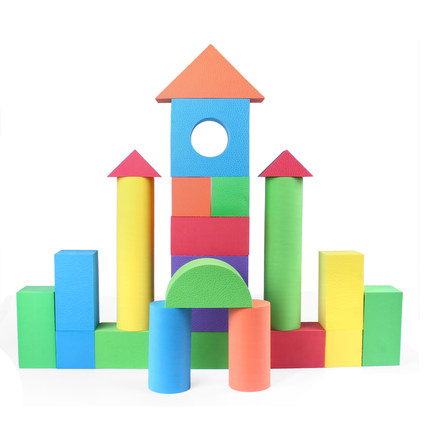

<p align="center">
    
</p>
<p align="center">
  <a href="http://cocoadocs.org/docsets/XFLegoVIPER"></a>
  
  
  
</p>

一个以VIPER架构理念的项目驱动引擎，提倡使用模块化编程，适用于大型项目和业务逻辑复杂的项目。
<p align="center">
    
</p>

##XFLegoVIPER特点
1、快速建立模块与模块之间的关联，提供简化路由API在界面与界面间跳转。

2、视图自动绑定事件处理者，无需再手动绑定。

3、能很好地结合MVVM设计模式，使用ReactiveCocoa进行层与层之间通信。

4、层与层通过接口通信，方便多人在同一模块开发，避免重复业务逻辑代码的发生。

5、可以与旧项目MVC、MVP、MVVM架构并存，并快速从这些架构过渡到VIPER架构代码。

##安装
1、使用Cocoapods
> pod 'XFLegoVIPER','1.0.0'

2、使用手动添加

把XFLegoVIPER整个库拖入到工程即可


##什么是VIPER？
VIPER 是一个创建 iOS 应用简明构架的程序。VIPER 可以是视图 (View)，交互器 (Interactor)，展示器 (Presenter)，实体 (Entity) 以及路由 (Routing) 的首字母缩写。简明架构将一个应用程序的逻辑结构划分为不同的责任层。这使得它更容易隔离依赖项 (如数据库)，也更容易测试各层间的边界处的交互。

作用：VIPER不属于MV*架构系列，但它是所有这些架构中单一责任分得最细的一个，有利于大型项目的构建和多人对同一个模块开发，好处有易维护、易迁移、代码多模块共用。VIPER架构结构就像搭积木一个，且很容易从传统MVC架构迁移过来，MVC的代码和VIPER架构可以很容易相互关联与调用，所以可以在一个项目里即有MVC架构的模块，又有VIPER架构的模块。

<p align="center">
    
</p>

##VIPER组成结构图


##XFLegoVIPER使用文档
###模块入口类`XFRouting`
Routing<或称为WireFrame>是一个模块开始的入口，也是管理模块与模块之间的跳转（相当于界面之跳转），它初化始当前模块的的所有层级关系链，也保存着上一个和下一个模块的引用关系链，是整个架构的关键层。

1、初始化一个模块，建立一个`XFSearchRouting`并继承自`XFRouting`,在.m文件里覆盖`+ (instancetype)routing`方法（使用`Activity`而不使用`UIViewController`是为了和旧项目MVC等架构区别开来）：
```objc
+ (instancetype)routing
{
    /**
     *  如果没有UINavigationController这个嵌套，可以传nil，或使用不带navigatorClass参数的方法
     *  除了ActivityClass必传外，其它都可以传空，这种情况适用于对MVC等其它架构的过渡
     */
    return [[super routing] buildModulesAssemblyWithActivityClass:[XFSearchActivity class]
                                                   navigatorClass:[UINavigationController class]
                                                   presenterClass:[XFSearchPresenter class]
                                                  interactorClass:[XFSearchInteractor class]
                                                 dataManagerClass:[XFPictureDataManager class]];
}
```
2、在`UIWindow`上显示：
```objc
    XFSearchRouting *searchRouting = [XFSearchRouting routing];
    // 获得导航栏
    UINavigationController *navigation = searchRouting.realNavigator;
    // TODO: 配置导航栏
    // ...
    // 调用显示方法，之后不用再写[self.window makeKeyAndVisible];
    [searchRouting showRootActivityOnWindow:self.window isNavigationControllor:YES];
```
3、模块之间的跳转,这个方法是`XFSearchPresenter`发起对`XFSearchRouting`的请求：
```objc
- (void)transitionToShowResultsMoudle {
    XFPictureResultsRouting *routing = [XFPictureResultsRouting routing];
    // 使用intentData传递意图数据
    [self pushRouting:routing intent:self.uiOperator.intentData];
}
```

###界面层`XFActivity`
在MVP、MVVM、VIPER架构中`UIViewController`和`UIView`一样是View，所以不能再当控制器来使用，而只能做UI的渲染、布局、动画的工作，这也是用`Activity`来替换`ViewController`命名的原因之一。那么谁来充当控制器呢？那就是`XFPersenter`,这个在后面会讲到。 

1、把一个`UIViewController`转为VIPER里的View的两种方式：
第一种，导入分类`UIViewController+XFLego.h`头文件（如果当前继承的父类不是`UIViewController`的话，推荐使用这种）：
```objc
#import <UIKit/UIKit.h>
#import "UIViewController+XFLego.h"

@interface XFSearchActivity : UIViewController

@end
```
第二种，继承自类`XFActivity`（如果当前就是继承普通的`UIViewController`的话，推荐使用这种）：
```objc
#import <UIKit/UIKit.h>
#import "XFActivity"

@interface XFSearchActivity : XFActivity

@end
```

2、请求事件处理
上面的操作会自动绑定在`XFSearchRouting`设置的事件处理者`XFSearchPersenter`,请求事件处理者可以使用：
```objc
    // 转换为事件处理实现的接口
    id<XFSearchEventHandlerPort> presenter = XFConvertPresenterToType(id<XFSearchEventHandlerPort>);
    [persenter loginButtonClickWithName:name pwd:pwd];
```
如果采用MVVM的双向绑定思想，则可以结合ReactiveCocoa的信号传递：
```objc
    id<XFSearchEventHandlerPort> presenter = XFConvertPresenterToType(id<XFSearchEventHandlerPort>);
    RAC(self,title) = RACObserve(presenter, navigationTitle);
    RAC(presenter, mainCategory) = self.mainCategoryTextField.rac_textSignal;
    RAC(presenter, secondCategory) = self.secondCategoryTextFiled.rac_textSignal;
    // 绑定命令
    self.searchButton.rac_command = presenter.executeSearch;
    
    // 其它绑定...
```


##相关文章
[iOS Architecture Patterns](http://www.tuicool.com/articles/rI7ZNn)

[Architecting iOS Apps with VIPER](https://objccn.io/issue-13-5/)

